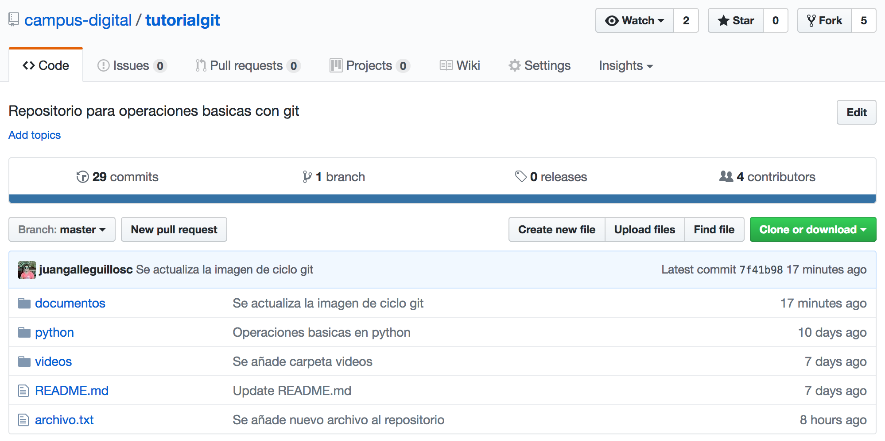

## Actividad 1: El objetivo es utilizar comandos mas avanzados de git.

### 1.1.Clonar repositorio en equipo local.

* Clonamos un repositorio creado con anterioridad.
* Para hacer esto copiamos la dirección o URL del repositorio desde github, esta dirección la obtienes cuando buscar un repositorio.

* Una vez encontrado el repositorio por este u otro medio, lo clonamos. Para ello, copiamos la URL del repositorio (boton verde).

* Nos saldra la URL a copiar, la cual copiamos:

* A continuación abrimos la terminal o consola de comandos (ctrl+t).

* En nuestro directorio personal clonamos nuestro repositorio con el comando `git clone`, como lo indica la imagen siguiente:

        git clone https://github.com/campus-digital/mitest.git

> La URL o dirección que sale en esta imagen es un ejemplo, esta será diferente segun el repositorio que quieras clonar. Por ende, no te preocupes si la URL que clonas no es la misma.

* Al terminar el proceso ya tenemos el repositorio clonado en nuestro equipo, este lo puedes verificar en la carpeta donde lo clonaste, ya que la clonación te crea una carpeta.

* Si ingresas a la carpeta y ejecutas `git status`, te deberia entregar la información correspondiente. Desde el momento en que te reconoce el comando, te indica que es un repositorio git.

### 1.2.Muevete entre commits

* Comencemos por abrir la terminal (ctrl+t) e ingresar a nuestro repositorio.

* Para movernos entre commits lo podemos hacer en base a su codigo identificador.
* Para hacer esto, es necesario utilizar el siguiente comando:

        git checkout <idcommit>

* Donde "***idcommit***" es el código identificador del commit, el cual es el codigo sha-1 que nos muestra `git log`.

>Se puede utilizar una version resumida del codigo identificador, la cual pueden ser los primeros 6 caracteres del codigo identificador completo.

* Ahora, muevete a alguno de los commits que tengas en tu repo, que no sea el commit en el que te encuentras, la siguiente imagen ilustra un ejemplo:

* Finalmente vuelve a tu último commit, lo puedes realizar con:

        git checkout master

* En el caso anterior utilizamos el nombre de la rama, por otro lado, si es que conoces el id (sha-1) de tu último commit, también lo puedes realizar con:

        git checkout <idcommit>

> Es importante mencionar que al referirte a la rama, siempre te mueves al último commit en ella.

### 1.3.Crea otras ramas

* Para ver las ramas que tienes y en la que te encuentras actualmente, utiliza el comando:

        git branch

* El comando anterior nos muestra una lista con las ramas existentes y con un asterisco la rama actual (deberíamos tener solo master).

        * master

* Puedes crear otras ramas desde una rama inicial, la cual siempre es master, con el comando:

        git branch <nombre>

* En nuestro caso crearemos la rama "***desarrollo***", lo cual lo realizamos de la siguiente manera:

        git branch desarrollo

* Si verificamos nuestras ramas con `git branch`, deberíamos obtener algo así:

### 1.4.Muévete entre ramas

* Las ramas nos permiten movernos entre dimensiones diferentes, cada rama es independiente de la otra hasta que se fusionan.
* Para movernos entre ramas, utilizamos el mismo comando que el para movernos entre commits, con la diferencia que utilizamos el nombre de la rama y no el id de commit, como se muestra a continuación:

        git checkout <nombre_rama>

* Movámonos a la rama "desarrollo" que creamos:

        git checkout desarrollo

* Podemos verificar la rama en la que estamos con:

* Realiza nuevas modificaciones al "***programa.py***" en esta rama y realiza los commits correspondientes (al menos 2), deberías tener algo así:

        git log --pretty=online
       

* Cámbiate a la rama master y verifica que no tiene los commits que creaste en la rama desarrollo:

* Como te diste cuenta puedes tomar caminos diferentes segun la rama en la que te encuentres. Puedes trabajar en paraleo sin que los cambios de una rama afecten a otra.

### 1.5.Fusiona las ramas.

* Con las ramas, no tan solo puedes crear caminos diferentes, sino que tambien puedes unir caminos.
* Para unir ramas o mover los commits desde una rama hacia otra tienes que fusionar las ramas.
* La fusión funciona ***desde otra rama hacia la actual***, es decir, si nos ubicamos en master, podemos fusionar desde
***desarrollo*** hacia ***master***.
* Esto lo realizaremos de la siguiente manera (recuerda moverte a master):

        git branch
        git merge desarrollo

* La fusión nos indica que se modificaron 7 líneas, 6 se agregaron y 1 se eliminó.
* Verifica el estado de los commits en ambas ramas y te darás cuenta que ahora ambas ramas tienen los mismos commits, ya que fusionaste.

